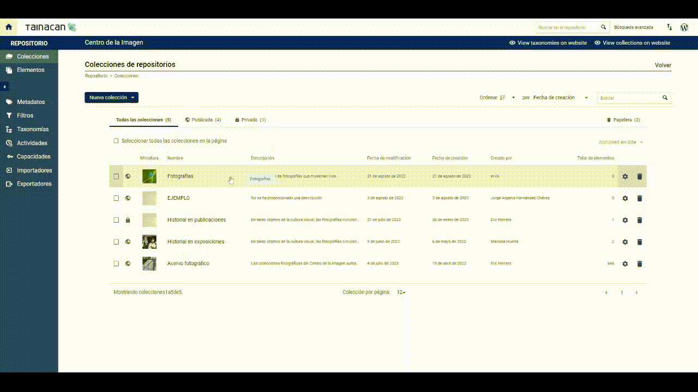
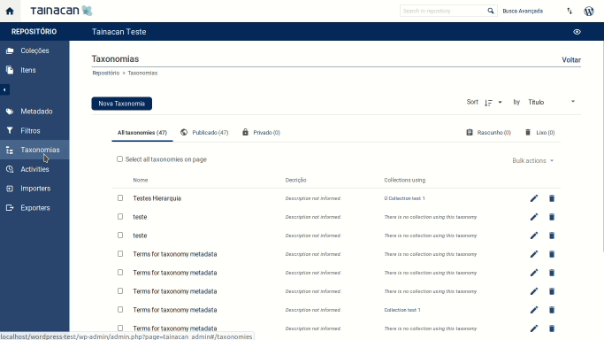
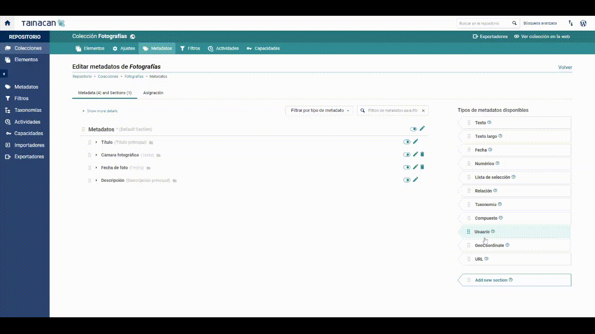
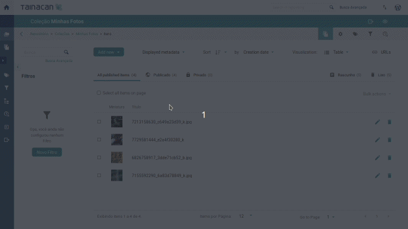
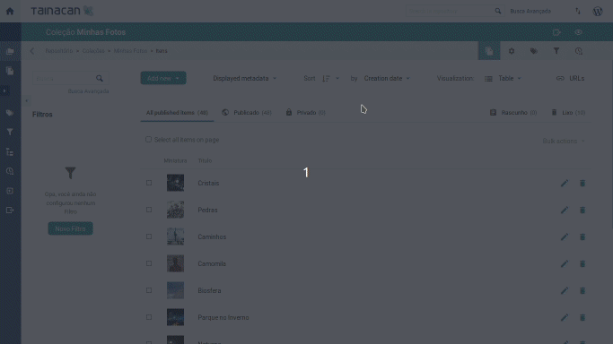
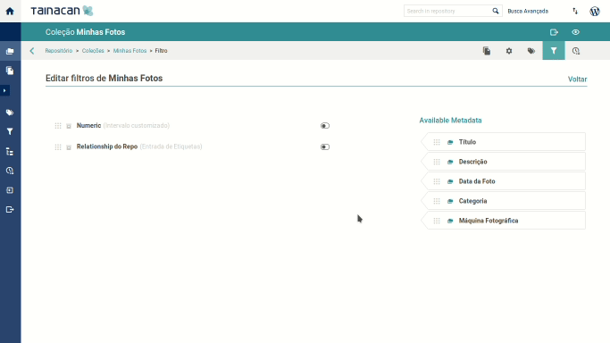
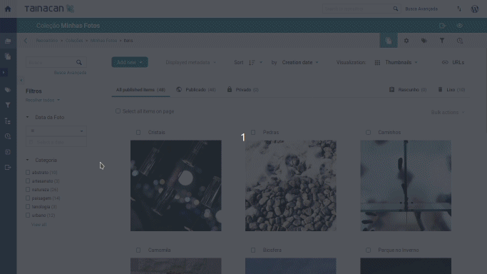
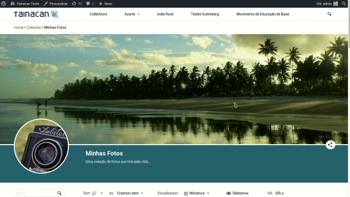
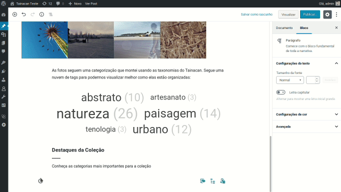

# Primeros pasos

?> _TODO_ Esta página está en _portugués brasileño_ solo hasta ahora. **Si puede, ayúdenos a traducirlo al _español_.**

Comprendamos qué es posible hacer con Tainacan y cómo puedo usarlo para crear y administrar mi repositorio digital de una manera fácil e intuitiva.

## ¿Qué queremos hacer?

Digamos que tengo una colección de fotos que quiero exponer al mundo. En mi sitio de WordPress ya tengo publicaciones y páginas que creé para hablar sobre eso, pero ahora quiero configurar mi repositorio y organizarlo de manera sistemática. El primer paso es crear la colección.

## Creación de la colección “Mis fotos”

En el panel de administración de mi sitio de WordPress, ya tengo instalado el complemento (plug-in) Tainacan y puedo acceder a él desde la barra lateral:

En la página de inicio del complemento, puedo crear mi colección, proceso que se realiza en el formulario de la imagen a continuación. Elegí un nombre, una descripción, imágenes en miniatura y de encabezado, y algunos modos de vista previa que probaremos más adelante.

## Configuración de metadatos de la colección

Una vez creada la colección, el siguiente paso es configurar los metadatos. Lo que estamos haciendo es crear los atributos mediante los cuales se describirán los elementos de la colección. Si es una colección de fotos, me interesa la siguiente información específica:

- El título de la foto;
- La descripción de la foto;
- La fecha en que se tomó la foto;
- La máquina utilizada para tomar la foto;
- Una categoría de fotos;

Cuando entramos en la página de metadatos, vemos que los dos primeros metadatos ya existen por defecto, aunque puedo deshabilitarlos o cambiar su etiqueta si lo deseo. Pero puedo crear los demás usando cualquiera de los tipos de metadatos disponibles.  En este caso, elijo:

- **Fecha de la foto** - _Tipo de fecha_ - La fecha en que se tomó la foto;
- **Máquina fotográfica** - _Tipo Texto simple_ - El nombre de la máquina utilizada para la foto;
- **Categoría** - _Tipo de taxonomía_ - Una categoría de fotos;

Para la “Categoría” elegí un metadato de tipo taxonomía. ¿Por qué? Bueno, vale la pena pensar, ¿qué es una categoría? Para mi colección, es un conjunto de términos que utilizo para describir una foto; estos términos pueden tener relaciones jerárquicas, como categorías principales y categorías secundarias, además de que aparecen nuevos según las nuevas fotos que llegan a mi colección. Esto encaja como anillo al dedo en lo que definimos como Taxonomías en Tainacan. Pero para crear un metadato de tipo “Taxonomía”, primero necesito configurarla como se explica a continuaciónPara la “Categoría” elegí un metadato de tipo taxonomía. ¿Por qué? Bueno, vale la pena pensar, ¿qué es una categoría? Para mi colección, es un conjunto de términos que utilizo para describir una foto; estos términos pueden tener relaciones jerárquicas, como categorías principales y categorías secundarias, además de que aparecen nuevos según las nuevas fotos que llegan a mi colección. Esto encaja como anillo al dedo en lo que definimos como Taxonomías en Tainacan. Pero para crear un metadato de tipo “Taxonomía”, primero necesito configurarla como se explica a continuación.

## Creación de la taxonomía de Categorías

En el menú del repositorio, en el lado izquierdo, podemos acceder a la lista de taxonomías y desde allí crear una nueva, llamada “Categoría”. Una vez creado, también puedo ingresar términos, que serán mis propias categorías, con las que etiquetaré mis fotos (por ejemplo, _urbano_, _naturaleza_, _resumen_…).

Volviendo a la página de configuración de metadatos, ahora puedo crear los metadatos que usarán esta taxonomía. También puedo dejar marcada la opción "Permitir la inserción de términos", para que pueda crear fácilmente nuevos términos mientras describo mis fotos. Por cierto, ¡es hora de traerlas a Tainacan!

## Subir los ítems o elementos a Tainacan

Los elementos de la colección “Mis fotos” son las propias fotos. Una forma posible es subirlas una por una, accediendo al menú “Crear ítem”, justo en la página de ítems de la colección. Pero supongamos que ya tengo varios de ellos guardados en una carpeta en mi computadora, entonces puedo seguir una ruta más simple, usando la función "Agregar ítems en masa":

Al subir mis fotos, puedo optar por la Edición en masa o por la Edición en secuencia. La primera sirve para tratar los metadatos comunes entre todas las fotos y la segunda para examinar cada elemento, uno por uno. Empecemos por lo que tienen en común estas fotos: la cámara. Como las tomé todas con la misma cámara, estableceré esta información en la pantalla de Edición en masa. Luego paso a Edición en secuencia, donde podemos ver que Tainacan ya ha generado una miniatura a partir de mis fotos, que se puede cambiar en el futuro. Mis fotos serán públicas y no hay archivos adjuntos relacionados con ellas, así que solo tengo que rellenar los metadatos.

### Captura de metadatos

Cada configuración realizada en la pantalla de metadatos se refleja aquí, en el paso de creación del elemento. Puedo poner el Título y la Descripción de la foto y una fecha válida que indique cuándo se tomó la foto. La cámara ya se configuró de antemano, por lo que no hay nada de qué preocuparse aquí. En cuanto a la Categoría, se completará como mejor me parezca, usando las categorías que creé anteriormente. Si he olvidado alguna categoría, puedo crear el nuevo término para la taxonomía aquí mismo, directamente desde el formulario de edición del elemento. Después de rellenar todos los metadatos, podemos ver el aspecto de nuestra colección volviendo a la página de elementos de la colección:

## Navegando por tu colección

Y ya está, ¡tenemos una colección de fotos en nuestro repositorio de Tainacan! Toma en cuenta que podemos cambiar el orden de visualización, cambiar el modo de vista de lista e incluso elegir qué metadatos mostrar en algunos casos. Como estoy creando una colección de fotos, prefiero utilizar el modo "Miniatura" para la visualización.

Del lado izquierdo de la pantalla ya tenemos disponible la búsqueda textual simple y la búsqueda avanzada. Pero podemos personalizar aún más la forma cómo filtraremos los elementos de esta colección usando... ¡filtros!

## Configurar filtros

Cada tipo de metadatos elegido puede filtrarse de distintas maneras. Aquí, en la página de filtros, podemos crear un filtro de Fecha para los metadatos de Fecha de la foto, así como un filtro con una lista de casillas de verificación para los metadatos de Categorías. Esta lista de casillas de verificación es una de las más interesantes que tenemos, porque con ella podemos explorar fácilmente todas las categorías que se utilizaron para etiquetar mis fotos.

Vayamos a la lista de elementos para probar estos filtros. Observa cómo, cuando aplicamos uno de ellos, aparece una etiqueta encima de la lista de elementos, para que podamos eliminar el filtro si lo deseamos. En el caso de las categorías, también tenemos un valor entre paréntesis junto a la etiqueta de la categoría. Este contador indica cuántos elementos existen actualmente en la colección con esta categoría, una vista que llamamos "Faceta".

## Visualización de tu colección en el sitio web

Todo esto suena muy bien, pero hasta ahora estamos dentro del panel de administración de Tainacan, al que solo pueden acceder aquellos con permiso... ¿y cómo se integra esto con mi sitio web de _WordPress_? Basta con hacer clic en el icono del ojo de la esquina superior derecha para averiguarlo:

Ahora la colección es pública en nuestro sitio web, en la dirección que está configurada por defecto allí en la página de Configuración de la colección, que vimos anteriormente. Aquí también entran en juego otros ajustes, como la imagen de cabecera, la miniatura y la descripción de la colección. Encima de la lista de elementos, tenemos la opción "Modos de visualización", que nos ofrece distintas formas de ver la colección, tal y como se configura también en la página Colección. Entre ellos, también hay un modo especial que está separado, el modo "Presentación".

Navegando por la colección, podemos hacer clic en el elemento y ver su página, donde están visibles los metadatos configurados.

Además de la página pública de la colección, existen otras páginas, predefinidas por Tainacan, que pueden ser de nuestro interés, y que pueden colocarse fácilmente accesibles en el menú del sitio web. La primera es la Lista de colecciones, disponible en /collections, que -obviamente- muestra todas mis colecciones públicas. Otra es la Lista de ítems o elementos del repositorio, accesible en /items, que funciona como una página de colección, pero muestra los elementos públicos de todas las colecciones, así como sus filtros. Tú eliges si mostrar o no estas páginas.

## Contar historias con bloques de Gutenberg

Tener páginas dedicadas para el contenido creado en Tainacan es interesante, pero quizás quiera exponer el contenido de Tainacan en medio de las entradas de mi blog o incluso en páginas creadas por mí, como mi página de inicio. Para ello, utilizamos los bloques de Gutenberg.

Gutenberg es como se llama al editor de contenidos de WordPress desde la versión 5.0. Es una herramienta intuitiva y flexible para construir publicaciones con estructura de bloques. Con él, puedo insertar fácilmente imágenes estilizadas, videos, citas y texto con diferentes alineaciones y tamaños. Pero así como puedo publicar imágenes de la galería de medios o insertar videos de un enlace de YouTube, es posible que quiera publicar elementos de mi colección de Tainacan. Aquí es donde entran en juego estos bloques.

Por ejemplo, si quiero mostrar, en medio de un post mi lista de artículos, puedo utilizar el Bloque de Búsqueda de Artículos, en lugar de simplemente poner un enlace a mi lista de artículos, que tiene mucha información y características que pueden distraer al lector. Veámoslo en uso en este post:

Por otro lado, también puedo querer dar una idea de cuáles son las categorías más comunes de mi colección, y para eso tengo el bloque Facetas (Facet Block), que con su nube de etiquetas me da una visión clara de ello.

Pero tal vez quiera mostrar un conjunto específico de Categorías en mi página de inicio y dejar un enlace para mis visitantes en la página de inicio. Para esto utilizo el Bloque de términos estáticos, que me permite elegir a mano cuáles mostrar:

Todos estos bloques tienen diferentes configuraciones de visualización y funcionamiento, para entenderlos mejor vale la pena leer nuestra [documentación](/es-mx/gutenberg-blocks.md).

## Explorando más a fondo

En este artículo te hemos mostrado algunas de las cosas que es posible hacer con Tainacan, pero no te equivoques, ¡esto fue solo un vistazo! Hay muchos otros temas que se pueden abordar como [Metadados de tipo relación](/es-mx/metadata.md#tipos-de-metadatos), [Importadores](/es-mx/importers.md), [Exportadores](/es-mx/exporters.md), Expositores, Estándar de metadatos, [Control de actividades](/es-mx/activities.md), [Archivos adjuntos](/es-mx/inserir-e-editar-arquivos), Tipos de Documentos, etc. También encontrarás materiales educativos en otros lugares además de este Wiki, como los enlaces que figuran en nuestra [página de videos](/es-mx/videos.md). ¡Esperamos que Tainacan te ayude a crear repositorios digitales increíbles!
