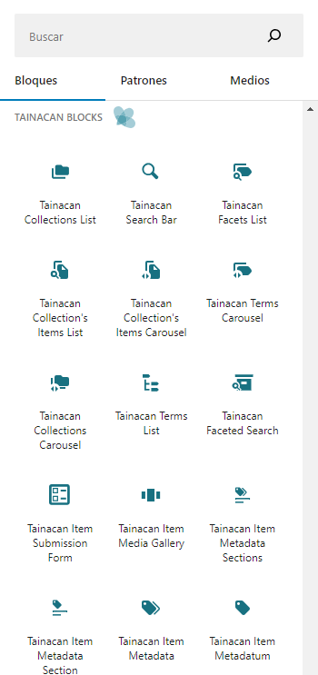
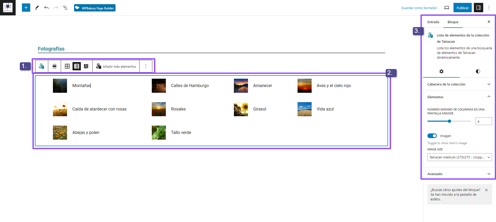
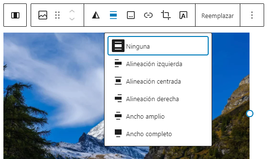

# Bloques Gutenberg

## ¿Qué es eso de Gutenberg?

A finales de 2018, WordPress 5.0 presentó al mundo su nuevo editor de Posts y Páginas, apodado Gutenberg:

[https://es.wordpress.org/gutenberg/](https://es.wordpress.org/gutenberg/ ":ignore").

Centrado en ofrecer una forma dinámica y visual de editar contenidos. En este editor, todos los elementos de una página, desde los párrafos más sencillos hasta la galería de imágenes más compleja, se denominan **"Bloques "**. Con él, es fácil construir un post de lanzamiento para una colección, utilizando imágenes con diferentes alineaciones, columnas, cuadrículas de texto, mapas, títulos o botones más llamativos. Además, [existen muchos plugins](https://es.wordpress.org/plugins/browse/blocks/ ":ignore") para WordPress que ofrecen nuevos bloques ricos y atractivos.

## Los bloques de Tainacan

Tainacan no podía quedarse al margen, y utiliza esta herramienta para proporcionar bloques dedicados a los contenidos generados en su repositorio.

> La combinación de bloques Gutenberg con su contenido Tainacan hace que sea sencillo crear narraciones, contar historias y presentar su colección digital de forma accesible al mundo.

Para utilizar uno de los bloques, basta con editar una entrada o página y buscar en la lista de bloques disponibles uno de nuestros bloques. Éstos son:

- [Lista de colecciones](/es-mx/blocks-collections#lista-de-colecciones) _(estático)_; 
- [Lista de condiciones](/es-mx/blocks-terms#lista-de-condiciones) _(estático)_;
- [Lista de elementos de la colección](/es-mx/blocks-items#lista-de-elementos-de-la-colección);
- [Galería multimedia de elementos](/es-mx/block-item#galería-multimedia-de-elementos);
- [Formulario de presentación de elementos](/es-mx/block-item#formulario-de-presentación-de-elementos);
- [Barra de Búsqueda](/es-mx/blocks-items#barra-de-búsqueda-tainacan) Tainacan;
- [Búsqueda por atributos](/es-mx/blocks-items#búsqueda-por-atributos) - _(Lista completa de elementos)_;
- [Lista de Aspectos](/es-mx/blocks-facets#lista-de-aspectos);
- [Carrusel de elementos](/es-mx/blocks-items#carrusel-de-elementos);
- [Carrusel de colecciones](/es-mx/blocks-collections#carrusel-de-colecciones);
- [Carrusel de condiciones](/es-mx/blocks-terms#carrusel-de-condiciones);

## Algunos conceptos importantes

Antes de empezar a explorar los bloques de Tainacan, sin embargo, es posible que desee entender algunos conceptos generales. La siguiente figura muestra las sesiones relacionadas con su bloque cuando se inserta en el editor:

1. Es la barra superior del bloque. Suele contener ajustes como el modo de visualización, la alineación del bloque, así como opciones para borrar, insertar bloques antes o después y crear un grupo de bloques;
2. Es el área de contenido del propio bloque. Cuando están activos, es decir, cuando se hace clic sobre ellos, los bloques de Tainacan suelen tener una zona gris con la configuración principal que debe realizarse (elige una fuente para los datos mostrados, como una colección). Esta región no aparece en la versión final del post, que puede verse alejando el foco del bloque;
3. Esta es la barra lateral del editor donde, además de la configuración del documento, están las opciones del bloque activo en ese momento. Aquí encontrará todo tipo de opciones relacionadas con el bloque. Al final de esta sección, todos los bloques tienen una opción avanzada que permite asignar clases a los bloques, que pueden utilizarse para realizar personalizaciones avanzadas con CSS.

### Alineaciones del bloque

De las configuraciones mencionadas, merece la pena comentar las **alineaciones de los bloques**. Algunos bloques (no sólo los de Tainacan) ofrecen una o varias de las alineaciones que se muestran en la figura de al lado.

En general, un bloque comienza por defecto con el ajuste "Centro". Si seleccionas "Alinear a la izquierda" o "Alinear a la derecha", el editor moverá el bloque hacia ese lado, utilizando las opciones CSS `float`. Esto puede funcionar bien si hay texto que fluye junto al bloque, **pero también puede dejar el bloque con muy poco espacio**, por lo que merece la pena probar y previsualizar el documento para asegurarse de que queda bien.

Las dos opciones "Anchura amplia" y "Anchura completa" son útiles para temas que ofrecen plantillas con un amplio margen que puede extrapolarse. La figura siguiente lo muestra:

El tema (_Tainacan Interface_) tiene un margen lateral que limita el ancho de la entrada a 1400px. Además, dentro de la propia entrada hay un margen interno que reduce aún más la anchura del cuerpo del texto. Usando "Anchura amplia" en [Bloque de Carrusel de Elementos](#carrusel-de-elementos) arriba, hemos extrapolado ligeramente el margen del cuerpo del texto para resaltarlo. Pero podemos ir más allá. Usando "Anchura completa", hacemos que el [Bloque de Elementos de la Colección](#lista-de-elementos-de-la-colección) en la parte inferior ocupe todo el ancho de la entrada. Esta función se utiliza a menudo para presentar elementos visuales destacados en su página, o para componer cabeceras personalizadas.

### Plantillas de página

Algunos temas ofrecen una función de WordPress llamada **"Plantillas de página "**. Son formas de ofrecer diferentes diseños de página a un usuario. Por ejemplo, usted podría preferir una página con la barra lateral a un lado, o sin ningún margen. Este ajuste puede hacerse en la **Barra lateral del editor**, en la **Pestaña Documento**, normalmente entre las últimas opciones.

La Interfaz _Tainacan_ ofrece actualmente 3 plantillas:

- `Default`;
- `Landing`;
- `Landing with Breadcrumb`;

Si ya has creado una página con él, entonces ya estás familiarizado con la plantilla `Default`. Esta es la plantilla utilizada para páginas y entradas y siempre tiene el siguiente orden:

1. El menú del sitio;
2. La barra de navegación auxiliar (también conocida como miga de pan);
3. El banner de cabecera, con el nombre del repositorio;
4. La sección de cabecera de la página, que incluye el título y los botones de compartir;
5. El contenido interno de la página - Esta es la parte que se crea a través del Editor de Bloques, Gutenberg;
6. El pie de página de la página;

Estos elementos pueden ser indeseables en algunas situaciones. Suponga que quiere crear una versión personalizada de la página de inicio de su repositorio. En este caso, podría utilizar la plantilla `Landing`, que sólo muestra los elementos **1**, **5** y **6** de la lista anterior. La plantilla `Landing with Breadcrumb` añade el elemento **2** a esta lista:

### WYSIWYG o las diferencias entre editor y página

Lo ideal sería que la experiencia de edición fuera, como decimos en informática, **"WYSIWYG "** por "What you see is what you get" (lo que ves es lo que obtienes). En otras palabras, lo que se ve en el editor de bloques debería ser equivalente a lo que se obtiene en la página publicada. Esto es cierto en el 99% de los casos, pero hay algunas excepciones.

En primer lugar, esta simetría entre editor y página depende mucho de lo bueno que sea el soporte proporcionado por el Tema. En algunos temas, incluso la fuente que se ve en el editor será diferente de la que se ve en la página. En _Tainacan Interface_ intentamos aplicar la mayor estilización posible, pero no todo sale perfecto. Un ejemplo de ello son los **alineamientos y márgenes**. En el editor, hay márgenes extra entre los elementos, que forman parte de los bloques. Estos márgenes son importantes para poder manejar los bloques, pero cuando visualicemos la página, no estarán ahí. Cuando usamos las alineaciones "Anchura amplia" y "Anchura completa", podemos pensar que nos caben X elementos en una sola línea de la página, pero cuando la visualizamos, vemos que hay más espacio, porque en el editor, tenemos **la barra lateral del editor y el propio panel de administración de WordPress ocupando espacio en pantalla**. Para eliminar un poco este efecto, puedes utilizar el editor en Pantalla Completa. Por último, **los colores que se ven en elementos como Títulos, Filas y Enlaces siempre serán los predeterminados del tema** en el editor (el "Azul Turquesa"), pero al visualizarlos en el sitio, habrán sido sustituidos por el color que se ha personalizado para el Tema.

### Bloques Nuevos

No tenga miedo de buscar [otros bloques](https://es.wordpress.org/plugins/browse/blocks/ ":ignore") para instalar y probar en tus publicaciones.

!> Es importante tener en cuenta, sin embargo, que con cada nuevo bloque, creas una dependencia para tu sitio. Si un día desinstalas este bloque, las entradas que lo utilizaban perderán su contenido o, como mínimo, lo desajustarán. Así que ¡utilízalo con moderación!

He aquí algunos ejemplos de bloques adicionales que nos gustan:

- [Grids - Layout Builder for WordPress](https://es.wordpress.org/plugins/grids/ ":ignore")

Otra observación importante es que cuando cambias de tema, tus bloques pueden tener un aspecto muy diferente. Gutenberg todavía está en pañales y no todos los temas ofrecen un buen soporte para sus características (como la alineación "Wide Width", por ejemplo). Nuestros bloques deberían funcionar bien en todos los temas en general, pero puede haber diferencias en el espaciado, la fuente y las alineaciones en función de los estilos de página.
