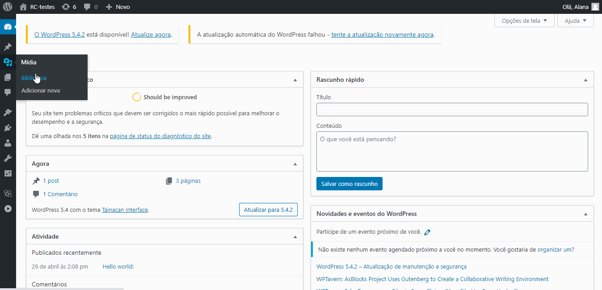

# Inserir e editar imagens

Existem algumas formas de adicionar imagens aos *“itens”* do Tainacan. Esse tipo de ação pode ser realizada individualmente, adicionando a imagem direto ao item ou primeiro à biblioteca, em sequência ou em massa. Sendo que, todas as imagens utilizadas no Tainacan se encontram alocadas na *“Biblioteca de Mídia do WordPress”*. 

## Biblioteca de mídia do WordPress

Todas as imagens utilizadas no Tainacan ficam armazenadas na *“Biblioteca de Mídia do WordPress”*. As imagens podem ser incorporadas diretamente à biblioteca antes de serem adicionadas a um *“item”*. As edições nas imagens só podem ser realizadas na *“Biblioteca de Mídia”*. 

### Inserir imagens

1. Acesse o *“painel de controle”* do WordPress; 

2. Na barra lateral esquerda, clique em *“Mídia”* e então em *“Biblioteca”*; 

3. Na tela da *“Biblioteca de mídia”* clique em *“Adicionar nova”* no canto superior esquerdo;

4. Arraste ou selecione a *“imagem”* que deseja adicionar.

   

### Editar imagens

1. Acesse o painel de controle do _WordPress_;

2. Na barra lateral esquerda clique em `Mídia` e então em `Biblioteca`;

3. Selecione a imagem que deseja editar;

4. Clique em `Editar imagem`;

5. Realize as edições desejadas:

   **“Recortar”**; 

   **“Rotacionar para a esquerda”**; 

   **“Rotacionar para a direita”**; 

   **“Virar na vertical”**; 

   **“Virar na horizontal”**; 

   **“Redimensionar a imagem”**; 

   **“Recorte da imagem”**. 

---

## Inserir imagem ao item

As imagens podem ser inseridas diretamente ao item, sem que antes sejam adicionadas a Biblioteca de mídia. Existem três formas de realizar essa ação:

1. **Inserir a imagem individualmente em cada item;** 
2. **Inserir imagens em sequência em um conjunto de itens;** 
3. **Inserir imagens em massa.** 

A ação de inserir imagens individualmente é indicada para os casos em que existem poucos itens em que imagens serão adicionadas. A inserção de imagens em sequência é adequada para um conjunto de itens, que pode abranger de dois até todos os itens de uma mesma página. Já a inserção de imagens em massa visa abranger uma grande quantidade de itens.

### Inserir imagem individualmente

1. Acesse o painel de controle do _WordPress_;

   

2. Na barra lateral esquerda, clique em *“Tainacan”*; 

   

3. Selecione uma coleção;

4. Selecione o *“item”* desejado e clique em *“Editar item”*; 

   

5. Clique em *“Arquivo”*; 

   

6. Selecione uma *“imagem”* que já se encontra na *“Biblioteca de mídia”* ou envie uma *“imagem”* do seu computador; 

   

7. Clique em *“Selecionar arquivo”*; 

   No *“rodapé da página”* é exibida uma barra de progresso com as informações referentes: 

   \* Última vez que as alterações realizadas foram salvas. 

   

8. No canto inferior direito da tela clique em: 

   

   1. **“Enviar para a lixeira”**, para que o *“item”* seja enviado para a lixeira; 
   2. **“Voltar para rascunho”**, para que o *“item”* tenha seu *status* alterado para *“rascunho”*; 
   3. **“Atualizar”**, para confirmar as alterações realizadas no “item”; 
   4. No rodapé da página é exibida uma barra de progresso com as informações referentes:

### Inserir imagem em sequência

1. Acesse o *“painel de controle”* do WordPress; 

   

2. Na barra lateral esquerda, clique em *“Tainacan”*; 

   

3. Selecione uma *“coleção”*; 

4. Clique nas *“caixas de seleção”* dos *“itens”* que deseja editar; 

   I. Todos os “itens” da página podem ser selecionados ao clicar em “Selecionar todos os itens da página”.

   

5. Clique em “Ações em massa” e então em “Editar itens selecionados em sequência”;

   

6. Clique em “Arquivo”

   

7. Selecione uma “imagem” que já se encontra na “Biblioteca de mídia” ou envie uma “imagem” do seu computador;

8. Clique em “Selecionar arquivo”;

   I. No “rodapé da página” é exibida uma barra de progresso com as informações referentes;

   i. Item atual e total de itens;

   ii. Última vez que as alterações realizadas foram salvas;

   

9. No canto inferior direito da tela, clique em:

   I. “Anterior”, para voltar ao “item” anterior;

   II. “Salvar como Rascunho”, para que o “item” exibido tenha seu status alterado para “rascunho”;

   III. “Atualizar”, para confirmar as alterações realizadas no “item” e ir para o próximo.

   

### Inserir imagem em massa

> Consulte [Importando arquivos e anexos](/pt-br/importers#importar-arquivos-e-anexos) para aprender como inserir imagens em massa.
