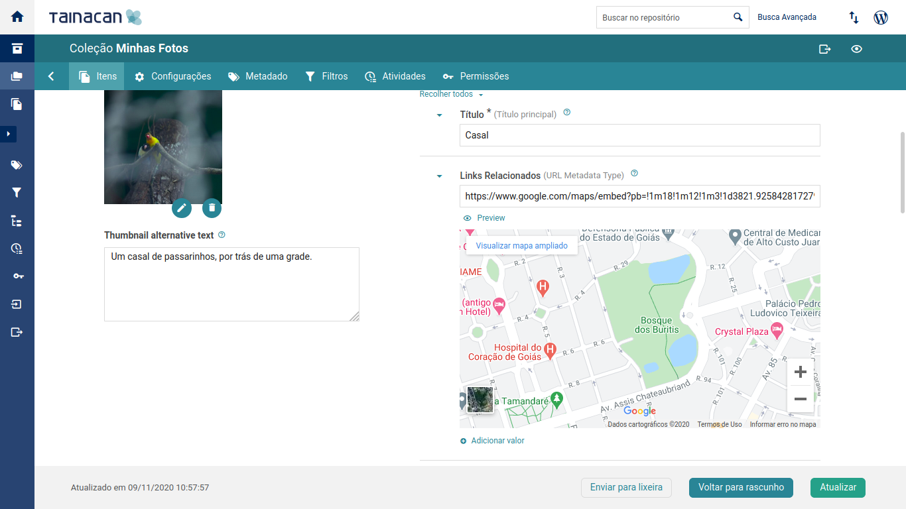
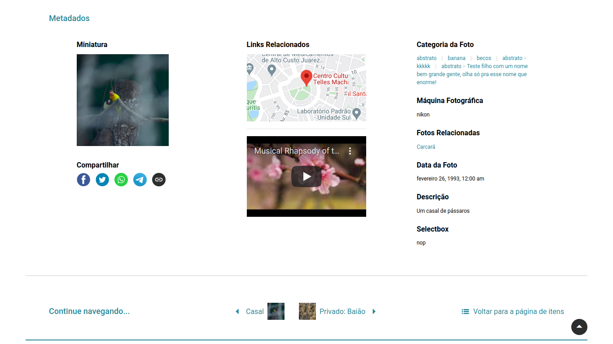

# Plugin: Tipo de Metadado URL

Este plugin expande a funcionalidade do plugin Tainacan adicionando suporte para um tipo de metadado extra, útil para exibir links de URLs como um conteúdo incorporado, seja pelo recurso de auto incorporar do _WordPress_ ou forçando o uso de um iframe. É uma solução para aqueles interessados em terem mais de um Documento tipo URL ou esperando que anexos aceitem URLs também.

## Instalação

Na sua página de plugins do _WordPress_, procure por "Tainacan" e ative o "plugin Tainacan Modos de Visualização Extra". Você também vai encontrar ele [neste link](https://br.wordpress.org/plugins/tainacan-metadata-type-url/). Dalí, basta instalar com o clique de um botão.

Se você preferir, pode também baixar o arquivo [.zip](https://github.com/tainacan/tainacan-metadata-type-url/releases) do [repositório do GitHub repository](https://github.com/tainacan/tainacan-metadata-type-url) e seguir as instruções de instalação descritas em [nossa sessão sobre instalar plugins](/pt-br/plugins#instalando-os-plugins).

Ative o plugin na sessão de plugins do painel administrativo do _WordPress_.

## Configuração

Vá para a página de Metadados da sua coleção ou do seu repositório. Na sessão "Tipo de Metadados Disponíveis", deve estar listado o tipo URL. Selecione-o e crie um novo metadado, dando o nome que você preferir. Por padrão este plugin tenta renderizar uma prévia do conteúdo o link usando a estratégia de auto incorporar do _WordPress_. Há [uma lista limitada](https://wordpress.org/support/article/embeds/#okay-so-what-sites-can-i-embed-from ":ignore") de links que funcionam com esta estratégia, tais como links do YouTube, Twitter, Spotify, etc. Se os seus links não aparecem lá (por exemplo, um link do Google Maps) e você ainda deseja exibir a prévia do conteúdo na lista de metadados do item, você pode ativar a opção "Forçar uso de iframe" e outras configurações relacionadas.

?> Mesmo usando a opção "Forçar uso de iframe", pode não ser possível que aquela URL que você está usando não permita incorporar o conteúdo por iframe. Esta é uma configuração habilitada por autores do site que não pode ser ignorada.

Com o metadado configurado e pronto, crie um novo item e insira valores de URLs nele. Você pode pré-visualizar com um botão enquanto estiver no formulário de edição do item, ou acessar a página do item para ver a prévia.

